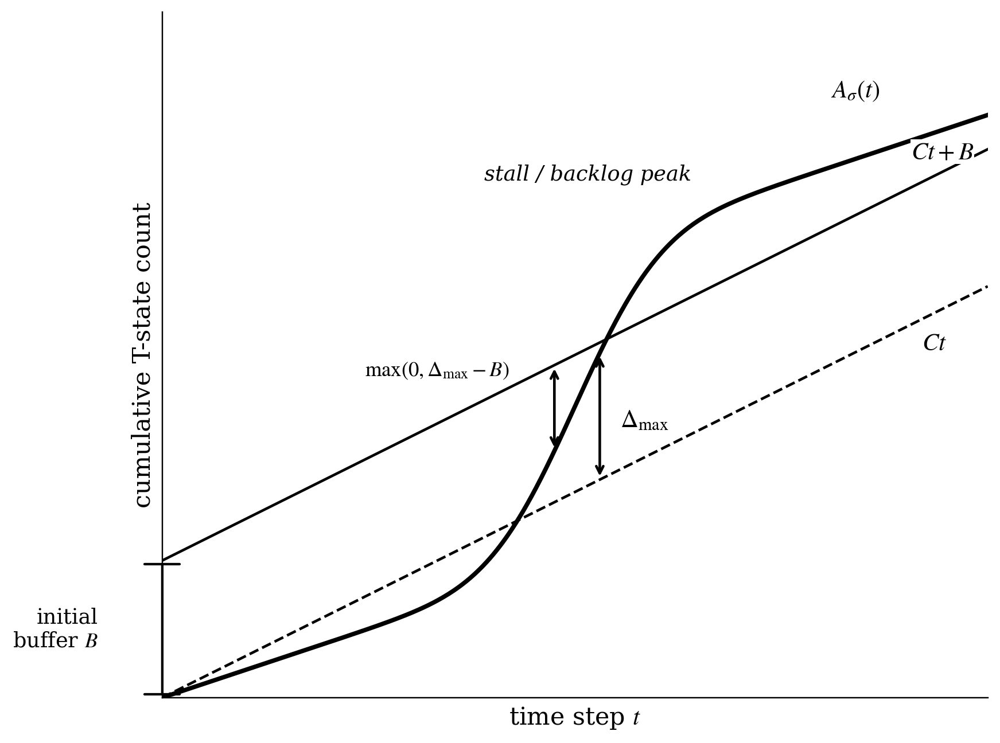

# BARC

## Overview

This repository accompanies the paper:

`When T-Depth Misleads: Predicting Fault-Tolerant Quantum Execution Slowdown under Magic-State Delivery Constraints`

This paper has been submitted to QCE 2026.

The artifact studies how circuit dependency structure interacts with a fixed delivery rate `C` and a fixed buffer capacity `B`, and packages the paper-facing figures and tables used by the manuscript.

## Problem

Fault-tolerant quantum compilers often optimize for static T-depth, but bounded magic-state delivery changes what actually runs fast. A schedule can look shallow on paper and still execute poorly if it creates bursts of T-gate demand that exceed delivery capacity and force protected waiting.

## Contribution

This artifact evaluates that mismatch using one structural indicator, `slack_ratio`, and one schedule-level indicator, `delta_max`. It shows when T-depth becomes misleading, validates a fixed-schedule lower bound on executable makespan, and packages the paper-facing figures and tables behind those claims.

## Key Figure

The figure below illustrates the core problem. The blue curve is cumulative T-state demand from a compiled schedule, while the dashed line is the cumulative supply envelope under delivery rate `C` and buffer `B`. When demand rises above supply, backlog accumulates. That backlog delays execution even if the original static schedule is short. The peak gap, `delta_max`, is the main schedule-level indicator used in the paper.



Paper figure files: [delta_max_illustration.png](barc_stage1/outputs/figures/delta_max_illustration.png), [delta_max_illustration.pdf](barc_stage1/outputs/figures/delta_max_illustration.pdf)

The main outputs of the artifact are:

- a structural metric based on T-node slack
- a system-level metric `delta_max`
- a fixed-schedule lower bound on executable makespan

The repository is organized around four layers:

- model: dependency DAGs and demand traces
- scheduling: static schedule construction
- simulation: bounded-delivery execution
- analysis: predictive evaluation and figure generation

## Key Concepts

- `slack_ratio`: fraction of T nodes with positive slack in the dependency DAG
- `mean_t_slack`: mean slack over T nodes
- `delta_max`: peak prefix deficit between cumulative T demand and cumulative delivery capacity
- `slowdown_ratio`: `T_exe / T_static`

For a fixed valid schedule with static depth `T_static`, delivery capacity `C`, buffer `B`, and prefix deficit `delta_max`, the artifact evaluates the lower bound

`T_static + ceil(max(0, delta_max - B) / C)`

against the simulated executed makespan `T_exe`.

## Reproducibility

Install dependencies:

Dependency file: [`barc_stage1/requirements.txt`](barc_stage1/requirements.txt)

```bash
python -m pip install -r barc_stage1/requirements.txt
```

### Reproduce the paper figures

The nine figures referenced by the manuscript live in
[`barc_stage1/outputs/figures/final_paper/`](barc_stage1/outputs/figures/final_paper/)
and match the LaTeX `\includegraphics{figures/final_paper/<name>.pdf}` paths
exactly. Run the following from the artifact root in order; the final
`publish_paper_figures.py` step renames and copies each figure into
`final_paper/` under its manuscript name:

```bash
cd barc_stage1

# 1. Main pipeline (predictive analysis, lower-bound table, real-trace scaling).
python scripts/run_qce_paper.py

# 2. Real-trace QFT comparison (produces qft_vs_other_real_traces.{pdf,png}).
python scripts/run_qft_real_trace_scan.py

# 3. Representative finite-gap cases for the lower bound.
python scripts/run_posthoc_analysis.py

# 4. Appendix robustness (stochastic supply + route-induced effective capacity).
python scripts/run_stochastic_supply_sensitivity.py
python scripts/run_routing_proxy_sensitivity.py
python scripts/build_appendix_robustness_figure.py

# 5. Layout-revised versions of the predictor-comparison and lower-bound figures.
python scripts/update_selected_final_paper_figures.py
python scripts/build_final_paper_revised_figures.py

# 6. Publish: copy + rename each figure into outputs/figures/final_paper/.
python scripts/publish_paper_figures.py
```

After step 6, [`outputs/figures/final_paper/`](barc_stage1/outputs/figures/final_paper/)
contains exactly the figures used by the paper. See
[`FIGURE_INDEX.md`](barc_stage1/outputs/figures/final_paper/FIGURE_INDEX.md)
for the file -> manuscript-label mapping.

### Reproduce the workload-family extension

The workload-family extension adds three first-class circuit-derived families
(carry-lookahead adder, modular-arithmetic block, QAOA MaxCut) alongside the existing
ripple adder, integer multiplier, and QFT traces. To regenerate the
workload-family tables and rebuild Fig. 6 and Fig. 7 in place:

```bash
bash barc_stage1/scripts/reproduce_real_workload_families.sh
```

This script does not modify the compressibility-family evaluation, the
lower-bound validation tables, or any other paper figure. See
[`docs/revision_notes_real_benchmarks.md`](barc_stage1/docs/revision_notes_real_benchmarks.md)
for variant labels, grid choices, synthesis precision, and the
`results/` -> `outputs/tables/` path mapping. LaTeX snippets implied by the
extension are collected in
[`docs/paper_text_patches.md`](barc_stage1/docs/paper_text_patches.md).

### Tests

```bash
cd barc_stage1
python -m unittest discover -s tests -p 'test_*.py'
```

### Submission bundle

Prepare a clean manuscript bundle containing the final PDF figures and key
tables referenced by the paper:

Bundle script: [`barc_stage1/scripts/prepare_submission_bundle.py`](barc_stage1/scripts/prepare_submission_bundle.py)

```bash
python barc_stage1/scripts/prepare_submission_bundle.py
```

The main pipeline generates:

- paper-facing tables in [`outputs/tables/`](barc_stage1/outputs/tables/)
- paper-facing figures in [`outputs/figures/`](barc_stage1/outputs/figures/)
- secondary tables and figures in [`outputs/appendix/`](barc_stage1/outputs/appendix/)

## Submission Assets

The manuscript-facing files are split into two groups:

- final PDF figures for LaTeX: [`barc_stage1/outputs/figures/`](barc_stage1/outputs/figures/) and [`barc_stage1/outputs/figures/final_paper/`](barc_stage1/outputs/figures/final_paper/)
- quantitative tables behind the reported claims, including appendix support tables: [`barc_stage1/outputs/tables/`](barc_stage1/outputs/tables/)

Running `python barc_stage1/scripts/prepare_submission_bundle.py` creates [`submission_bundle/`](submission_bundle/) at the repository root with:

- [`figures/`](submission_bundle/figures/) laid out to match the LaTeX `\includegraphics{figures/...}` paths
- [`tables/`](submission_bundle/tables/) containing the main CSV/TXT assets needed to audit manuscript claims
- [`MANIFEST.md`](submission_bundle/MANIFEST.md) summarizing every copied file

## Manuscript Figure Map

These are the figure PDFs directly referenced by the current paper draft.
File names match the LaTeX `\includegraphics{figures/final_paper/<name>.pdf}`
paths.

| Figure | Manuscript label |
| --- | --- |
| [`figures/delta_max_illustration.pdf`](barc_stage1/outputs/figures/delta_max_illustration.pdf) | (key illustration) |
| [`figures/final_paper/predictor_comparison.pdf`](barc_stage1/outputs/figures/final_paper/predictor_comparison.pdf) | `fig:predictor_comparison` |
| [`figures/final_paper/incremental_predictive_gain.pdf`](barc_stage1/outputs/figures/final_paper/incremental_predictive_gain.pdf) | `fig:incremental_gain` |
| [`figures/final_paper/structure_execution_chain.pdf`](barc_stage1/outputs/figures/final_paper/structure_execution_chain.pdf) | `fig:empirical_chain` |
| [`figures/final_paper/lower_bound_vs_actual.pdf`](barc_stage1/outputs/figures/final_paper/lower_bound_vs_actual.pdf) | `fig:lower_bound` |
| [`figures/final_paper/qft_vs_real_traces.pdf`](barc_stage1/outputs/figures/final_paper/qft_vs_real_traces.pdf) | `fig:qft_vs_real` |
| [`figures/final_paper/real_trace_scaling.pdf`](barc_stage1/outputs/figures/final_paper/real_trace_scaling.pdf) | `fig:real_scaling` |
| [`figures/final_paper/qft_approximation.pdf`](barc_stage1/outputs/figures/final_paper/qft_approximation.pdf) | `fig:qft_approx` |
| [`figures/final_paper/appendix_robustness_supply_routing.pdf`](barc_stage1/outputs/figures/final_paper/appendix_robustness_supply_routing.pdf) | `fig:appendix_robustness_supply_routing` |
| [`figures/final_paper/appendix_gap_cases.pdf`](barc_stage1/outputs/figures/final_paper/appendix_gap_cases.pdf) | `fig:appendix_gap_cases` |

## Manuscript Table Map

These files are the primary quantitative sources for the current draft.

- [family_summary.csv](barc_stage1/outputs/tables/family_summary.csv): family-level slowdown and `Delta_max` summaries
- [inversion_summary.csv](barc_stage1/outputs/tables/inversion_summary.csv): T-depth inversion rates
- [predictive_classification_summary.csv](barc_stage1/outputs/tables/predictive_classification_summary.csv): stall and inversion AUC summaries
- [predictive_regression_summary.csv](barc_stage1/outputs/tables/predictive_regression_summary.csv): slowdown correlation summaries
- [predictive_multivariate_regression.csv](barc_stage1/outputs/tables/predictive_multivariate_regression.csv): representative multivariate slowdown fits
- [incremental_predictive_models.csv](barc_stage1/outputs/tables/incremental_predictive_models.csv): incremental gain values used in the predictor discussion
- [bootstrap_slack_vs_tdepth.csv](barc_stage1/outputs/tables/bootstrap_slack_vs_tdepth.csv): paired bootstrap confidence intervals
- [causal_chain_correlations.csv](barc_stage1/outputs/tables/causal_chain_correlations.csv): structure-to-system-to-execution correlation chain
- [lower_bound_validation.csv](barc_stage1/outputs/tables/lower_bound_validation.csv): 4,904 finite instances used in lower-bound validation
- [lower_bound_gap_cases.csv](barc_stage1/outputs/tables/lower_bound_gap_cases.csv): representative finite positive-gap cases
- [qft_real_trace_summary.csv](barc_stage1/outputs/tables/qft_real_trace_summary.csv): exact-QFT real-trace summary values
- [real_trace_scaling_summary.csv](barc_stage1/outputs/tables/real_trace_scaling_summary.csv): adder/multiplier scaling values
- [qft_approximation_reduced_grid_summary.csv](barc_stage1/outputs/tables/qft_approximation_reduced_grid_summary.csv): exact vs approximate QFT reduced-grid comparison
- [stochastic_supply_ranking_summary.csv](barc_stage1/outputs/tables/stochastic_supply_ranking_summary.csv): appendix-level stochastic supply sensitivity summary
- [routing_proxy_ranking_summary.csv](barc_stage1/outputs/tables/routing_proxy_ranking_summary.csv): appendix-level routing proxy sensitivity summary
- [delivery_aware_pass_probe_round2_summary.csv](barc_stage1/outputs/tables/delivery_aware_pass_probe_round2_summary.csv): appendix-level preliminary compiler-probe summary

## Main Results

The primary figures for the paper are:

- [slack_vs_slowdown.png](barc_stage1/outputs/figures/slack_vs_slowdown.png)
- [delta_max_vs_slowdown.png](barc_stage1/outputs/figures/delta_max_vs_slowdown.png)
- [slack_vs_stall.png](barc_stage1/outputs/figures/slack_vs_stall.png)
- [structure_to_execution_chain.png](barc_stage1/outputs/figures/structure_to_execution_chain.png)
- [lower_bound_vs_actual.png](barc_stage1/outputs/figures/lower_bound_vs_actual.png)

The primary tables are:

- [stage1_grid_scan.csv](barc_stage1/outputs/tables/stage1_grid_scan.csv)
- [family_summary.csv](barc_stage1/outputs/tables/family_summary.csv)
- [predictive_classification_summary.csv](barc_stage1/outputs/tables/predictive_classification_summary.csv)
- [predictive_regression_summary.csv](barc_stage1/outputs/tables/predictive_regression_summary.csv)
- [predictive_multivariate_regression.csv](barc_stage1/outputs/tables/predictive_multivariate_regression.csv)
- [causal_chain_summary.csv](barc_stage1/outputs/tables/causal_chain_summary.csv)
- [causal_chain_correlations.csv](barc_stage1/outputs/tables/causal_chain_correlations.csv)
- [lower_bound_validation.csv](barc_stage1/outputs/tables/lower_bound_validation.csv)
- [predictive_analysis_summary.txt](barc_stage1/outputs/tables/predictive_analysis_summary.txt)
- [paper1_reframing_summary.txt](barc_stage1/outputs/tables/paper1_reframing_summary.txt)

The real-trace grounding remains available under [`src/real_trace/`](barc_stage1/src/real_trace/) and [`outputs/real_trace/`](barc_stage1/outputs/real_trace/). In the paper narrative, these traces serve as grounding examples rather than as the main source of method comparison.

## Scope and Limitations

The artifact uses:

- deterministic delivery capacity
- deterministic buffer capacity
- dependency-aware synthetic DAG families
- fixed schedule policies

The main deterministic paper pipeline does not include:

- routing or layout effects
- stochastic delivery
- noise, decoding, or full physical simulation
- optimal scheduling over all valid schedules

Separate appendix robustness scripts provide first-order sensitivity checks for stochastic supply and route-induced effective-capacity proxies. The lower bound remains a fixed-schedule deterministic result. It does not characterize optimal scheduling across all valid schedules and it does not minimize `delta_max` over the full schedule space.

The repository also contains a preliminary quota-respecting scheduling probe. This probe is included only as appendix support for the current manuscript and should not be interpreted as a full compiler evaluation.

## Repository Layout

The source tree keeps the paper pipeline compact:

- [`barc_stage1/src/dag.py`](barc_stage1/src/dag.py), [`barc_stage1/src/trace.py`](barc_stage1/src/trace.py): model layer
- [`barc_stage1/src/schedule.py`](barc_stage1/src/schedule.py): scheduling layer
- [`barc_stage1/src/simulator.py`](barc_stage1/src/simulator.py): simulation layer
- [`barc_stage1/src/metrics.py`](barc_stage1/src/metrics.py), [`barc_stage1/src/predictive_analysis.py`](barc_stage1/src/predictive_analysis.py): analysis layer
- [`barc_stage1/src/plots.py`](barc_stage1/src/plots.py): figure generation
- [`barc_stage1/src/stochastic_supply.py`](barc_stage1/src/stochastic_supply.py): stochastic supply sensitivity utilities
- [`barc_stage1/src/robustness_workloads.py`](barc_stage1/src/robustness_workloads.py): representative workload selection for appendix robustness studies
- [`barc_stage1/src/real_trace/`](barc_stage1/src/real_trace/): real-trace grounding utilities
- [`barc_stage1/src/real_trace/circuit_to_dag.py`](barc_stage1/src/real_trace/circuit_to_dag.py): convert real Qiskit circuits into the internal DAG representation used by scheduling probes
- [`barc_stage1/scripts/run_qce_paper.py`](barc_stage1/scripts/run_qce_paper.py): single entry point
- [`barc_stage1/scripts/run_stochastic_supply_sensitivity.py`](barc_stage1/scripts/run_stochastic_supply_sensitivity.py): stochastic supply robustness study
- [`barc_stage1/scripts/run_routing_proxy_sensitivity.py`](barc_stage1/scripts/run_routing_proxy_sensitivity.py): route-induced effective-capacity proxy study
- [`barc_stage1/scripts/build_appendix_robustness_figure.py`](barc_stage1/scripts/build_appendix_robustness_figure.py): combine robustness summaries into a manuscript-facing PDF figure
- [`barc_stage1/scripts/run_delivery_aware_pass_probe_round2.py`](barc_stage1/scripts/run_delivery_aware_pass_probe_round2.py): appendix-level preliminary compiler-probe summary generation
- [`barc_stage1/tests/`](barc_stage1/tests/): slack validation tests

## Appendix Outputs

Non-primary outputs are written to [`outputs/appendix/`](barc_stage1/outputs/appendix/). This includes:

- policy comparison artifacts
- QTV tradeoff artifacts
- family-level gain boxplots

These files are retained for completeness, but they are not part of the main paper narrative.
